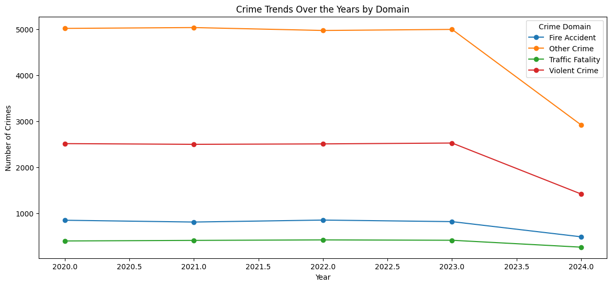

# Exploratory Data Analysis (EDA) of Crime Data in India

## 📌 Project Overview
This project focuses on Exploratory Data Analysis (EDA) of crime data in India to uncover patterns, trends, and correlations. By analyzing various crime statistics, we aim to gain insights into crime distribution across states, crime types, and other influencing factors.

---

## 📂 Dataset Information
- **Dataset Name:** Crime in India
- **Source:** [Dataset](https://www.kaggle.com/datasets/sudhanvahg/indian-crimes-dataset)
- **Attributes:**
  - Report Number
  - Date Reported
  - Date Of Occurence
  - City
  - Crime Code
  - Victim Age
  - Victime Gender
  - Crime Description
  - Weapon used...

## Steps Performed

1. **Loading the Dataset**

    - The dataset was loaded into a Pandas DataFrame for analysis.

2. **Missing Value Analysis**

    - Generated a heat map to visualize missing values in the dataset.

    - Identified missing data patterns for potential imputation or cleaning.

3. **Time of Occurrence Analysis**

    - Converted the 'Time of Occurrence' column to datetime format.

    - Extracted the hour of the day from the timestamp.

    - Visualized the crime frequency by hour using a histogram with KDE overlay.

4. **Top 50 Most Frequent Crime Codes**

    - Counted and sorted crime codes by frequency.

    - Selected the top 50 most frequent crime codes.

    - Created a bar plot for better visualization of prevalent crime types.
    
5. **Gender Analysis**

    - Generated visualizations to analyze the relationship between gender and crime codes concerning crime frequency.

6. **Geographical Distribution of Crimes**

    - If geographical coordinates were available, mapped crime occurrences.

    - Generated a heat map to highlight high-crime-density areas.

7. **Crime Trend Analysis Over Time**

    - Grouped the dataset by month and year to analyze trends.

    - Created line plots to visualize seasonal patterns and long-term trends.

8. **Correlation Analysis**

    - Computed a correlation matrix to identify relationships between variables.

    - Visualized the correlation matrix using a heat map.

    - Insights and Findings

    - Identified peak crime hours and possible trends based on time of occurrence.

    - Mapped crime hotspots to aid in better resource allocation.

    - Evaluated relationships between different crime-related variables.

## Some important EDA Plots

### Crime Rates by City: A Comparative Overview

### Distribution of Case Closure Times Across Different Cases

### Crime Concentration by City and Crime Codes

### Crime Victims by Gender Distribution

### Age Distribution of Crime Victims

### Trends in Crime Rates Across Different Months

### Annual Crime Trends by Domain

## Future Work

- Further refine the dataset by handling missing values effectively.
- Implement predictive modeling to forecast crime occurrences.
- Expand geographical analysis with additional GIS tools.
- Explore additional factors influencing crime rates, such as socio-economic data.

#### Contributors

Ayush Sur